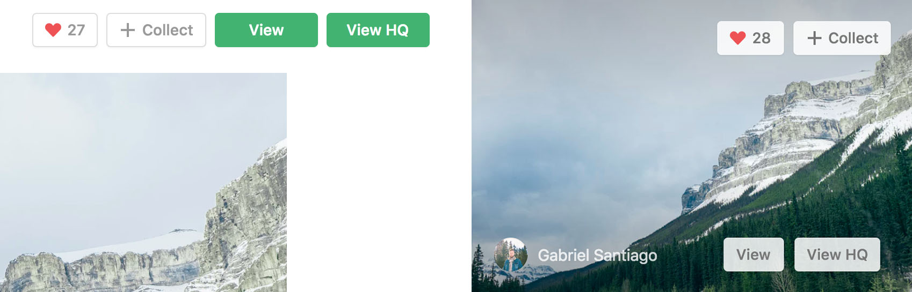

# Unsplash view image

Replaces forced download button by two "View" and "View RAW" buttons

## Quickstart
- Download repo on your computer
- Go to : `chrome://extensions` 
- Click on : "Load unpacked extension" and select the repo folder
- You're ready to go !

